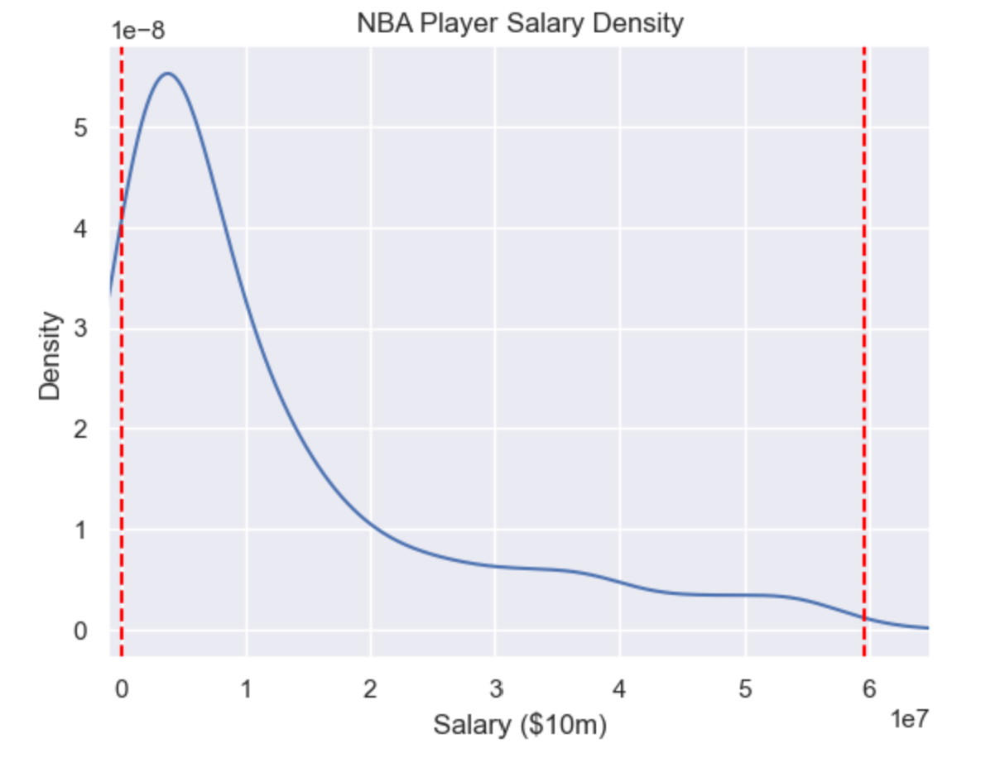
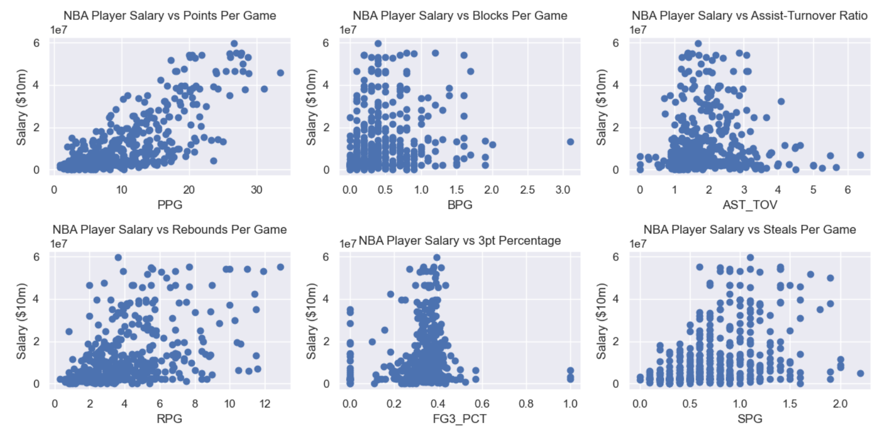
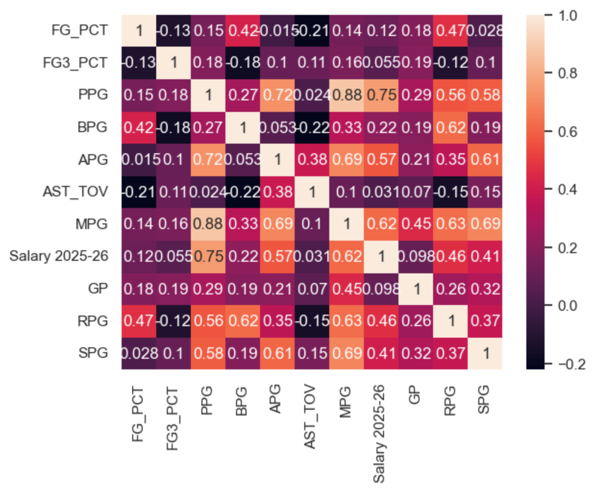

# NBA Salary and Performance Analysis 2025-2026

This project employs exploratory data analysis to examine the relationship between player performance metrics and player salaries in the National Basketball Association (NBA). The project also develops multiple linear regression models to estimate player salaries using performance statistics.

---

## Table of Contents
- [Project Overview](#project-overview)
- [Key Insights](#key-insights)
- [Dataset](#dataset)
- [Objectives](#objectives)
- [Technologies Used](#technologies-used)
- [Exploratory Data Analysis](#exploratory-data-analysis)
- [Modeling](#modeling)
- [Results](#results)
- [How to Run](#how-to-run)
- [Author](#author)

---

## Project Overview

The goal of this project is to explore relationships between NBA player performance stats and annual salaries using exploratory data analysis and regression modeling techniques. This information could be used to evaluate whether a player's salary is in line with the expected value for a player with their level of performance, gain an understanding of the potential value of a new contract for a player, or identify which kinds of contributions could be undervalued or overvalued by NBA teams. To achieve this goal, I first inspected the distributions of player stats such as poins per game; then, I examined relationships between different performance metrics and a player's salary. I then created and evaluated two linear regression models for a player's salary with one created manually and the other one using sequential feature selection.

---

## Key Insights

 - Player performance stats are not valued equally as some stats have a much stronger correlation with salary than other, but almost all performance metrics have at least some correlation with salary.
 - Points per game is overwhelmingly the player stat that is most associated with a player's salary.
 - Though it is not a perfect representation of the relationship between NBA player performance metrics and salary, a linear regression model works reasonably well to predict salary based on in-game stats.
 - Over half of the variation in player salaries can be explained by a linear regression model.

---

## Dataset

The dataset is a combination of a salary dataset and a player performance dataset. I cleaned the data by removing players with missing salary values and reformatting names to match between datasets (i.e. Dončić vs Doncic) then performed an inner merge on the datasets. This merge removed players who were missing from the salary dataset because they are on two-way contracts that split their time between the NBA and NBA G-League, as well as players who missed the entirety of the 2025-26 NBA season due to injury or suspension. Finally, I removed players that did not play a significant amount of games or minutes and changed the players' stats from a "total" format to a "per game" format (i.e. from total rebounds to rebounds per game).

### Player Stat Dataset:

- [NBA Player Stats Dataset 2026](https://www.kaggle.com/datasets/nilesh2042/nba-player-stats-2026)
- Rows/Columns: 530/26
- Includes player names and teams as well as performance statistics such as games played, minutes played, points scored, rebounds, assists, steals, blocks, shooting, percentages, turnovers, efficiency rating, and more.

---

### Salary Dataset:

- [2025-26 NBA Player Contracts](https://www.basketball-reference.com/contracts/players.html)
- Rows/Columns: 490/5
- Includes player names, teams, salary in current and future seasons, and total guaranteed earnings.

---

## Objectives

- Perform exploratory data analysis (EDA)
- Identify key player stats affecting a player's salary
- Clean and reformat data
- Train and evaluate regression models
- Evaluate model performance

---

## Technologies Used

 - Python
 - Jupyter Lab
 - Pandas
 - Scikit-Learn
 - Matplotlib
 - Seaborn
 - Statsmodels

---

## Exploratory Data Analysis

I computed the player salary quartiles and made a density plot of salaries to get a general understanding of the salary distribution. This distribution is skewed right with the majority of salaries falling below $10 million and a relatively small portion of salaries above $20 million.

I also made a set of density plots for the offensive and defensive performance stats to understand the distributions of player metrics. The distributions for each stat vary in spread but are all generally unimodal. Most of the distributions are skewed right like the salary distribution, but free throw percentage and three point percentage are slightly skewed left.

Similar to the offensive distributions, the distributions of defensive stats vary noticeably. Rebounds per game and steals per game have relatively wide distributions while steal-turnover ratio and blocks per game have much tighter distributions.

My next step was to plot the interactions between player salaries and different variables that I predicted would be important for estimating player salary. Based on the scatter plots, points per game has the strongest correlation with player salary. Rebounds per game and steals per game look to have a weak corrlation with salary while 3pt percentage, assist-turnover ratio, and blocks per game do not look to have a significant connection to player salary.

I made a correlation heatmap with seaborn to visualize the interactions between variables. I was particularly interested in how other variables are correlated with salary. The metrics that proved to be most correlated with a player's salary were minutes per game, assists per game, rebounds per game, steals per game, and especially points per game. Blocks per game are seemingly valued less than these other stats, as they had only roughly half as high of a correlation with salary compared to metrics like steals or rebounds per game. This heatmap also shows some other notable correlations, such as the strong correlation between minutes per game and other game-level stats such as points per game.


### EDA Images

Salary Density Plot:



Scatterplots with relationship between salary and performance statistics:



Correlation Heatmap:




---

## Modeling

I used the player performance metrics to create a multiple linear regression model with scikit-learn for a player's salary. After experimenting to find some unhelpful variables, I removed stats which were not formatted as ratios, which gave usable results. This model had an adjusted R^2 value of around 0.521, and therefore explained most of the variation in player salaries.

I also used automated feature selecting to find a model which was slightly more predictive than the model I manually created. I removed the "Guaranteed" and "MIN" columns: Guaranteed was too strongly correlated with salary as a part of the player's contract and not a metric and MIN counted total minutes over the courses of the season and yielded weaker models when the feature selector chose it over MPG. I experimented with a few configurations for the feature selector and landed on 3 features selected in a backwards direction with an adjusted R^2 value of about 0.538. This model used 3 point percentage, points per game, and minutes per game as predictors of salary.

Finally, I created diagnostic plots to check the regression model assumptions. The QQ plot has a strongly linear pattern that indicates that the normality of residuals assumption is clearly met. The constant variance assumption is a bit suspect, as the points at the edges of the residuals vs. fitted plot look to have very slightly less variance than those in the middle and there is a minor funnel shape in the scale-location plot. The linear relationship assumption also looks to be somewhat problematic as there is a gradual but definitely noticeable curve to the points of the residuals vs. fitted plot with higher values to the left and lower values to the right. It is also worth noting that the influence plot shows a few outliers in the data. Finally, the independence of observations assumption is likely not completely met, as players on the same teams will likely have some influence on each others' performances. Overall, while there are definitely some issues with the linear modeling assumptions and a linear model may not be perfect to capture the multifaceted nature of contract value, the issues seem to be minor enough to acceptably model this relationship linearly.

---

## Results

Intuitively, it makes sense that player performances and player salaries are linked. However, by exploring player data from the 2025-26 NBA season and using regression modeling, I have highlighted the player metrics that have the greatest connection with the players' salaries and have constructed a model to estimate what a player's salary could be based upon their performances.

---

## How to Run

Clone the repository:

```bash
git clone https://https://github.com/a-g-mikulsky/NBA-Salary-and-Performance-Analysis-2025-2026.git
```

Install dependencies:

```bash
pip install -r requirements.txt
```

Run the notebook:

```bash
jupyter notebook
```

---

## Author

Aiden Mikulsky | Data science student at the University of Wisconsin-Madison

- LinkedIn: www.linkedin.com/in/aiden-mikulsky-ab226a337
- Email: aidenmiku920@icloud.com
